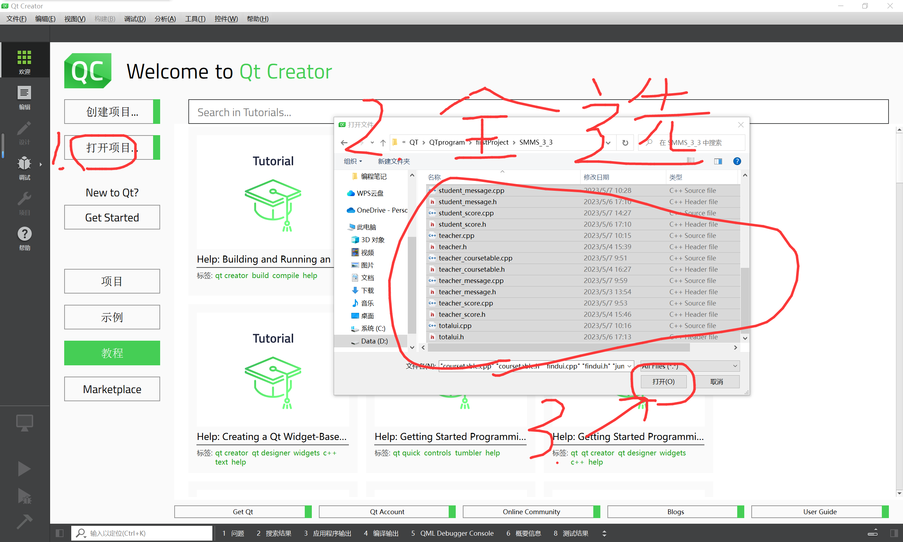
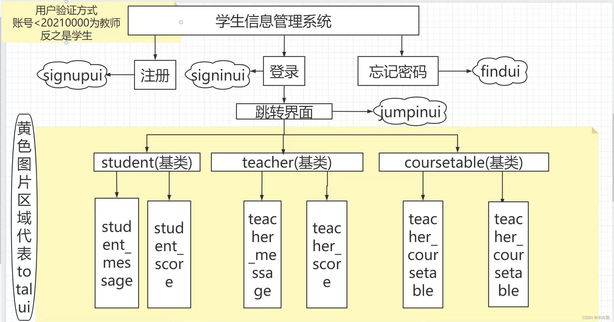
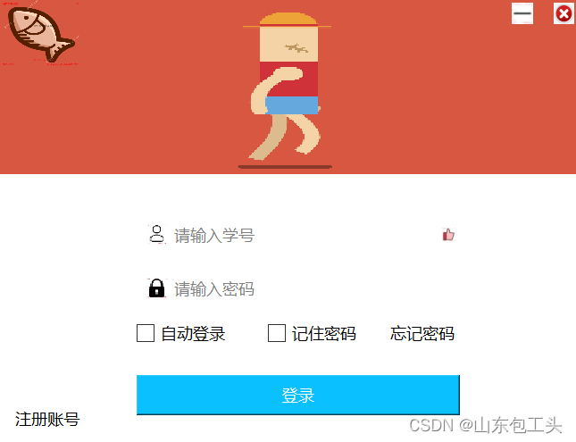
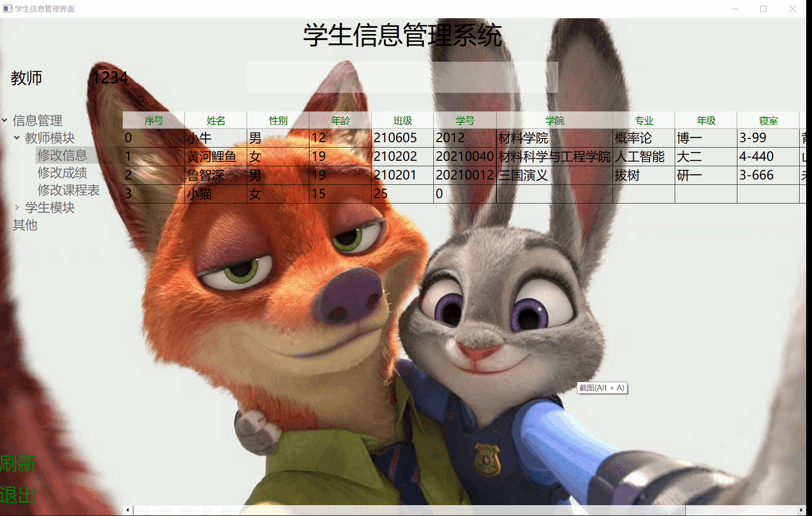

# 环境配置

1. QT Creator 9.0.2

   ```
   https://mirror.sjtu.edu.cn/qt/official_releases/qtcreator/9.0/9.0.2/
   ```

2. qt 6.6.0

   ```
   https://mirrors.tuna.tsinghua.edu.cn/qt/official_releases/qt/6.6/6.6.0/single/
   ```

版本过高或低都不兼容


# 项目启动

## **1.下载(源码)文件**

## **2.打开QT Creator，点击左侧(打开项目)，找到下载文件的路径**

## **3.将文件所有文件全选，然后点击右下角(打开)**

## 4.图片演示操作




# **项目演示**







